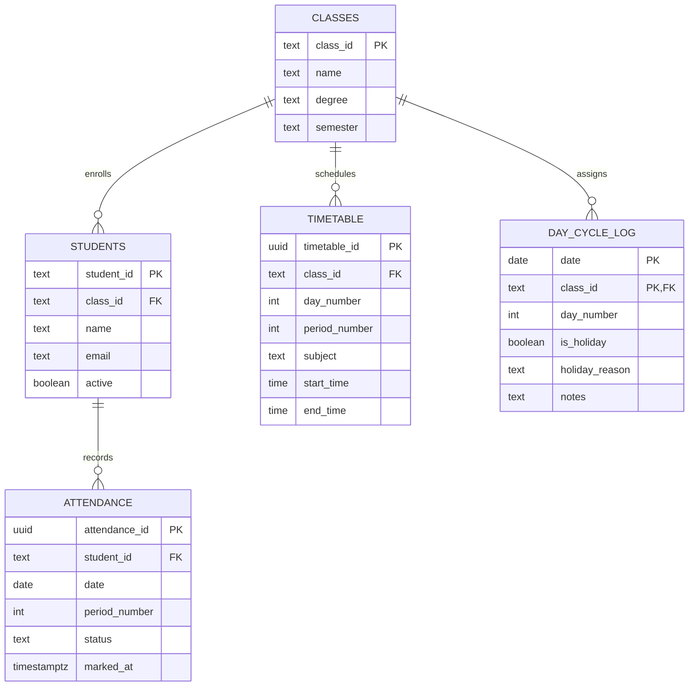

# 🎓 Smart College CR Attendance Management System

A high-performance, mobile-first Daily Period Attendance Register & Analytics Application built for Class Representatives (CRs) and Faculty at **SPIHER (St. Peter's Institute of Higher Education and Research)**.

Designed for **Year II / Semester III (Class Room 245)** supporting **B.Tech CSE (CSE-25)** and **B.Tech AI&DS (AIDS-25)**.

---

## 🌟 Key Features

### 1. 🔄 Rotating Day Order 1–6 Calendar Cycle
* The college uses a continuous rotating cycle: **Day 1 → Day 2 → Day 3 → Day 4 → Day 5 → Day 6 → Day 1...**
* Dates do **not** bind to fixed calendar days (Monday $\neq$ Day 1).
* **Smart Holiday Skip Logic**: Marking a holiday (e.g. festival or non-working Saturday) **preserves** the cycle number for the next working date without consuming a day order.

### 2. ⚡ Rapid Daily Period Attendance Marking (`/attendance`)
* Engineered for 10-second CR period marking with large mobile-friendly touch targets.
* **Attendance Statuses**:
  * 🟢 **Present (`P`)** / Attended
  * 🔴 **Absent (`A`)** / Absentee
  * 🟡 **On Duty (`OD`)** / Official college duty (counts as attended hours)
* **Instant Actions**: `[Mark All Present]`, `[Clear All]`, live counter gauges, unmarked student alerts, and sticky bottom save bar.
* **Duplicate-Proof Upsert**: Enforces a strict database constraint on `(student_id, date, period_number)`.

### 3. 📊 Official University Period Register Grid (`/students`)
* Renders the classic university attendance register matrix:
  ```text
  B.TECH (CSE) 2025-2029 | II YEAR | III SEM
                   JULY 2026

  ┌────┬────────────┬──────────────┬───────────────┬─────────────────────┐
  │ No │ Reg No     │ Student Name │ 01/07         │ TOTAL HOURS PRESENT │
  │    │            │              │ 1 2 3 4 5 6 7 │                     │
  ├────┼────────────┼──────────────┼───────────────┼─────────────────────┤
  │ 1  │ SPC25CSU001│ ABU BUHARI I │ ✓ ✓ ✓ ✓ ✓ ✓ ✓ │                  14 │
  │ 2  │ SPC25CSU002│ ARUN KUMAR G │ ✓ ✓ A ✓ ✓ ✓ ✓ │                  13 │
  │ 3  │ SPC25CSU003│ ARUN ROSHAN  │ A A A A A A A │                   0 │
  └────┴────────────┴──────────────┴───────────────┴─────────────────────┘
  ```
* **Sticky Frozen Columns**: Student roll numbers and names stay locked while scrolling across 31 days horizontally.
* **Symbol Mode Toggle**: Switch between checkmarks (`✓ / A / OD`) and letter codes (`P / A / OD`).

### 4. 📈 Dynamic Attendance Calculations
* **Formula**:
  $$\text{Attendance Percentage} = \frac{\text{Present Hours } (P) + \text{OD Hours } (OD)}{\text{Total Working Hours } (W)} \times 100$$
* Percentages are calculated **on-the-fly** from atomic attendance records and are never permanently stored in the database.
* Defaulter tracking highlights attendance $< 75\%$ (Warning) and $< 65\%$ (Condonation cutoff).

### 5. 📑 Multi-Sheet Excel (`.xlsx`) & CSV (`.csv`) Exporters
* **Excel Workbook Architecture**:
  * **Sheet 1 (`Attendance Details`)**: Filtered period-by-period audit log.
  * **Sheet 2 (`Student Summary`)**: Roll number, Name, Working Hours, Present Hours, OD Hours, Absent Hours, Attendance %.
* **Register Matrix Excel Export**: Merged-header spreadsheet matching the university hardcopy attendance register format.
* **Dynamic File Naming**: e.g. `CSE-25_Attendance_August-2026.xlsx`, `AIDS-25_Attendance_2026-08-01_to_2026-08-20.csv`.

### 6. 🛠️ Admin Control Center (`/admin`)
* **Classes & Students**: Add new students, edit details, toggle active/inactive status, search, and import from XLSX/CSV.
* **Timetable Editor**: Visual 7-period editor for Day Orders 1–6 with 12-hour AM/PM formatting.
* **Holidays & Day Cycle Log**: Date assignments, holiday registry, and strong warnings when modifying dates that already have attendance records.

---

## 🏛️ Class & Timetable Master Data

| Class ID | Program Name | Batch | Semester | Classroom | Enrolled |
|---|---|---|---|---|---|
| **`CSE-25`** | B.Tech Computer Science and Engineering | 2025–2029 (Year II) | Semester III | Room 245 | 44 Students (`SPC25CSU001` – `044`) |
| **`AIDS-25`** | B.Tech Artificial Intelligence & Data Science | 2025–2029 (Year II) | Semester III | Room 245 | 16 Students (`SPC25CSU601` – `616`) |

### Daily Period Schedule (Room 245)
* **Period 1**: 8:30 AM – 9:30 AM
* **Period 2**: 9:30 AM – 10:30 AM
* ☕ *Tea Break: 10:30 AM – 10:45 AM (Non-attendance)*
* **Period 3**: 10:45 AM – 11:45 AM
* **Period 4**: 11:45 AM – 12:45 PM
* 🍱 *Lunch Break: 12:45 PM – 1:15 PM (Non-attendance)*
* **Period 5**: 1:15 PM – 2:10 PM
* **Period 6**: 2:10 PM – 3:05 PM
* **Period 7**: 3:05 PM – 4:00 PM

---

## 🗄️ Database Architecture (PostgreSQL / Supabase)



### Core Database Constraints
* **Duplicate Prevention**:
  ```sql
  CONSTRAINT uq_attendance_per_student_period UNIQUE (student_id, date, period_number)
  ```
* **Status Domain**:
  ```sql
  CONSTRAINT chk_status CHECK (status IN ('P', 'A', 'OD'))
  ```
* **Mutual Holiday / Day Number Exclusion**:
  ```sql
  CONSTRAINT chk_day_or_holiday CHECK (
      (is_holiday = TRUE AND day_number IS NULL) OR
      (is_holiday = FALSE AND day_number IS NOT NULL)
  )
  ```

---

## 🚀 Getting Started

### 1. Prerequisites
* **Node.js**: v18.0 or higher
* **npm**: v9.0 or higher

### 2. Clone and Install
```bash
git clone https://github.com/roshzxn1003/attendance-reg.git
cd attendance-reg
npm install
```

### 3. Configure Supabase (Optional)
Create a `.env.local` file in the project root:
```env
VITE_SUPABASE_URL=https://your-project-id.supabase.co
VITE_SUPABASE_ANON_KEY=your-anon-public-key
```
> *Note: If Supabase credentials are not provided, the application runs seamlessly using verified local cache fallback.*

### 4. Apply Database Migrations
Execute the SQL migration script located in `supabase/FULL_MIGRATION_FOR_SQL_EDITOR.sql` in your Supabase SQL Editor.

### 5. Start the Development Server
```bash
npm run dev
```
Open [http://localhost:5173](http://localhost:5173) in your browser.

### 6. Build for Production
```bash
npm run build
```

---

## 🛡️ Security & Integrity

* **Row Level Security (RLS)**: Enforced on all Supabase tables.
* **Class Isolation**: Runtime validation strictly blocks cross-class student marking.
* **Secret Protection**: `.env` and `.env.local` files are ignored from version control; zero service-role keys exposed.

---

## 📄 License
MIT License. Built for SPIHER CRs & Faculty.
