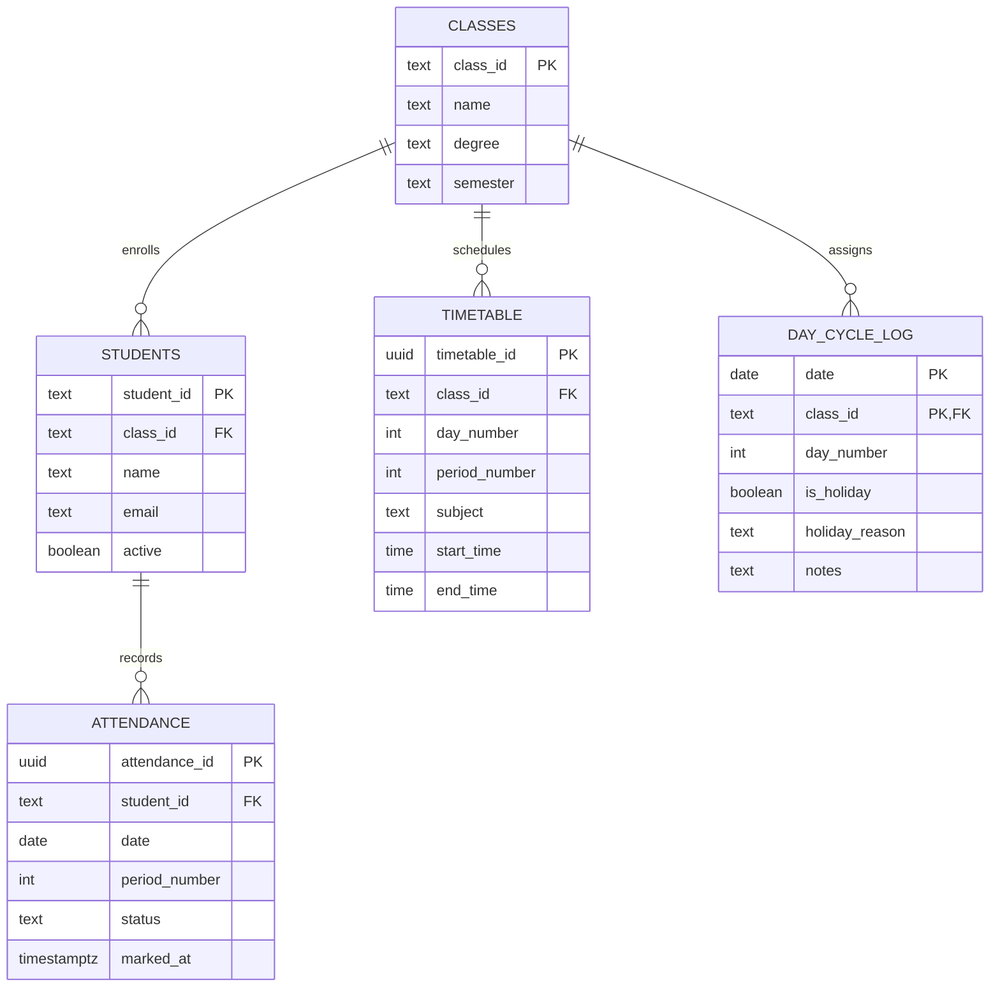

# 🎓 SPIHER Smart Attendance & Analytics System

A high-performance, mobile-first Daily Period Attendance Register, Backlog Entry Wizard & Analytics Application built for Class Representatives (CRs), Faculty, and Students at **St. Peter's Institute of Higher Education and Research (SPIHER)**.

Designed for **Year II / Semester III (Class Room 245)** supporting **B.Tech CSE (`CSE-25`)** and **B.Tech AI&DS (`AIDS-25`)**.

---

## 🚀 Key Modules & Architecture

```
attendance-app/
├── public/                 # PWA Web Manifest, Icons, Service Worker (Offline First)
├── src/
│   ├── components/         # Modular React UI Components
│   │   ├── admin/          # Admin settings, system reset & management
│   │   ├── attendance/     # Daily period marking grid, one-by-one card, WhatsApp report tab
│   │   ├── auth/           # Role-based change password & auth modals
│   │   ├── backlog/        # Rapid handwritten register backlog wizard
│   │   ├── common/         # Buttons, badges, cards, class selector, skeletons
│   │   ├── daycycle/       # Rotating Day 1–6 cycle indicators & holiday managers
│   │   ├── layout/         # AppLayout, Navbar, PageTransition, StaggeredMenu
│   │   ├── students/       # Register matrix, student profiles, browse lists, bulk import
│   │   └── timetable/      # Visual Day 1–6 timetable editor & modal
│   ├── context/            # Global AppContext, AuthContext, ToastContext
│   ├── data/               # Master student rosters, timetable slots, subjects, class info
│   ├── hooks/              # Custom React hooks (Attendance, DayCycle, Timetable, Reports)
│   ├── lib/                # Supabase client, PWA registration, XLSX parser, export utils
│   ├── pages/              # Lazy-loaded route views (Attendance, Students, Backlog, Portal, Admin)
│   ├── routes/             # Protected router with Role-Based Access Control (RBAC)
│   ├── services/           # Supabase CRUD operations & offline sync queues
│   └── types/              # Core domain TypeScript interfaces & type definitions
├── supabase/               # SQL database schema migrations & RLS policies
└── vite.config.ts          # Rollup manual chunk code-splitting configuration
```

---

## 🌟 Portals & Features

### 1. 🎓 Student Portal (`/student-portal`)
* **Personal Attendance Gauge**: Dynamic circular SVG progress ring and exam eligibility status ($\ge 75\%$).
* **Working Hours Summary**: Real-time breakdown of Attended Hours, OD Hours, and Missed Hours.
* **Subject-Wise Analysis**: Breakdown of attendance across each subject and lab session.
* **Full Audit Log**: Filterable chronological log of every period attended with Day Order and timing.

### 2. ⚡ Class Representative (CR) / Faculty Portal (`/attendance`)
* **Period Attendance Marking**: 10-second period roll call with large touch targets and keyboard shortcuts (`P`, `A`, `OD`).
* **One-by-One Swiping Mode**: Fast focus mode with mobile haptic feedback and auto-advance.
* **WhatsApp Shareable Reports**: Instant formatting for Single Period or Full-Day attendance summaries with absentees lists.
* **Rapid Backlog Entry Wizard (`/backlog-entry`)**: One-click bulk entry tool for handwritten historical registers with tokenized inputs (e.g. `4`, `18(p1-p4)`).
* **Multi-Month Period Register Matrix (`/students`)**: Responsive sticky frozen columns for seamless desktop & mobile horizontal scrolling across 1 to 5 months.
* **Faculty Subject Reports (`/faculty-report`)**: Subject-level attendance breakdown, defaulter tracking, and university-compliant Excel & CSV exports.

### 3. 🛠️ Administrator Control Center (`/admin`)
* **Classes & Roster Management**: Add new students, edit roll numbers, toggle active status, and bulk import from XLSX/CSV.
* **Timetable Editor**: Interactive Day 1–6 slot editor with customizable subject assignments and timings.
* **Day Cycle & Holiday Registry**: Manage rotating Day Orders, register academic holidays, and adjust cycle points.

---

## 🔄 Rotating Day Order 1–6 Cycle Engine

SPIHER operates on a continuous rotating Day Order cycle (**Day 1 → Day 2 → Day 3 → Day 4 → Day 5 → Day 6 → Day 1...**):
* Dates do **not** bind to fixed calendar days (Monday $\neq$ Day 1).
* **Smart Holiday Skip Logic**: Marking a holiday (e.g. festival or Sunday) **preserves** the cycle number for the next working date without consuming a cycle slot.

$$\text{Attendance Percentage} = \frac{\text{Present Hours } (P) + \text{OD Hours } (OD)}{\text{Total Working Hours } (W)} \times 100$$

---

## 🗄️ Database Architecture (PostgreSQL / Supabase)



---

## 🛠️ Developer Scripts

| Command | Description |
| :--- | :--- |
| `npm run dev` | Start local Vite development server at `http://localhost:5173` |
| `npm run build` | Type-check with TypeScript and build optimized production chunks |
| `npm run typecheck` | Run standalone TypeScript type-checker across the entire codebase |
| `npm run preview` | Preview production build locally |

---

## 🛡️ Security & Offline Capabilities

* **Offline-First PWA**: 100% functional without internet in classrooms via Service Worker cache and local IndexedDB/localStorage sync queue.
* **Atomic Batch Sync**: Synchronizes queued offline attendance records in bulk once an internet connection is re-established.
* **Row-Level Security (RLS)**: Enforced across all Supabase database tables.
* **Class Isolation**: Runtime validation strictly blocks cross-class student marking.

---

## 📄 License
MIT License. Developed for SPIHER Department of Computer Science & Engineering.

